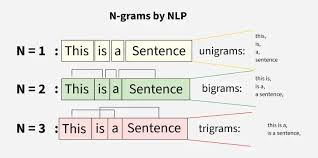
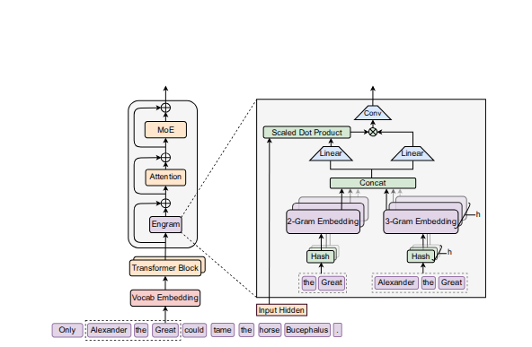

hi we are going to talk about deepseeks new arch its always facinating too read deepseeks paper the are some of the most inovative and informative peice of moder litrature here is a deep dive into it hope you like it 

what is a the some of the bigges problem modern models face in terms of scaling and performance?

Its CONTEXT or we can say "memory" transformers have a crucial flaw it cant search through its memory effectively as the context window grows it becomes harder for the model to find relevant information here if there was a way to solve this thing deepseek intruduced a lookup table 

what is a lookup table?A lookup table is a data structure that allows for efficient retrieval of information based on a key. 

 Transformer gave us one mechanism — attention + FFN — and we've been scaling it ever since 

 there were 2 problems with ATTENTION 
 1 compute sparcity means that at any given moment, only a fraction of a model's parameters actually do work

 SIMILARY 

 2 memory sparcity means that at any given moment, only a fraction of a model's stored knowledge is actually retrieved

  MoE was the first real structural innovation: it said "not every parameter needs to fire for every token." it solved compute sparcity but left memory part unadressed 

also waht about attent bottleneck at long context? Also unaddressed. Two problems. Two papers.

before engram 
lets set up some context with N-gram. basically the core idea was predict nth word with help of privious n-1 words . while you maintain of sliding window and use it to predict the next word and repeat ! 

for engram 

now we have everythign ready , lets talk about engram

it start with basic token compression wwith the idea of Standard tokenizers treat Apple, apple, APPLE as completely different tokens with different IDs. For the purpose of N-gram lookup, these are the same thing. So Engram collapses them

This is done using Unicode normalization (NFKC), lowercasing, and accent stripping. The result: a 23% reduction in effective vocabulary size

now comes the lookup table, HASHING ! 

Step 3 — Hashing the N-gram
Now the actual lookup. For each position t in the sequence, Engram looks at the last 2 tokens (bigram) and last 3 tokens (trigram) separately.
The hash function is simple XOR mixing:
For the trigram ("Alexander", "the", "Great") with multipliers [M1, M2, M3]:

mix = ID("alexander") × M1
mix = mix XOR (ID("the") × M2)
mix = mix XOR (ID("great") × M3)
table_index = mix % prime_number
The result is a single integer — an index into the embedding table. This is O(1). No neural network, no routing, just arithmetic on the token IDs.

now the question we can thing about with multilple heads 
Two different N-grams could accidentally hash to the same index (collision). thats a valid piont 

To reduce this risk, Engram uses 8 independent hash functions per N-gram order, each with different multipliers and a different prime modulus. Each head produces its own embedding vector. All 8 are concatenated.

lets see how does the table looks 

each row in the embedding is a learned dense vec ( not probability distribution word count or something ) but a rich representation trained end-to-end alongside the rest of the model.

During training, these vectors learn to encode everything useful about the N-grams they represent:

The table is massive — potentially billions of rows — but each lookup only touches a handful of rows per token. That's the memory sparsity.

now comes the GATE 

here is a example gpt gave me 
     "Imagine you have a friend with perfect recall but zero social awareness. You ask them a question and they immediately blurt out everything they know about the topic — regardless of whether it's relevant to your specific situation. Sometimes brilliant. Often noise."

at this piont n gram is also doing the same thing retriving a vector the moment it found somthing similar, 

one more example 

    "Take the trigram "Princess of Wales." The embedding table has seen this phrase thousands of times during training. It has built a rich vector for it. But that vector is a blend of every context the phrase appeared in:
"Princess of Wales" in training data:
  → 40% sentences about Diana Spencer
  → 35% sentences about the royal title
  → 25% sentences about the Welsh region
  → the table stores a weighted average of all three
Now your model is processing: "The mountains of the Princess of Wales region are stunning."
The table still fires the same vector — the one that is 40% about Diana. The retrieval has no idea it is in a geography sentence. It just saw the trigram and pulled the matching row.
If you inject that vector unconditionally into the hidden state, you are pushing Diana Spencer into a sentence about Welsh mountains. That is not helpful. That is noise.
"

THE solution 
the gate solve this by introducing contact between 2 things 

    The retrieved memory e_t — what the table thinks is relevant
    The hidden state h_t — what attention has already established about the context

a basic dot product with sigmoid and wallha 
it the retirved memory and hidden state are pionting in smae direction sigmoid pushes to 1 and we have our retrived context 

after gating a tiny depthwise causal convolution runs over the gated values

Y = SiLU( Conv1D( RMSNorm(gated_values) ) )  +  gated_values
This serves two purposes. First it expands the receptive field slightly — the convolution has kernel size 4 and dilation equal to the N-gram order, so it can see a few N-gram-spaced positions back. Second it adds a small amount of nonlinearity, making the output more expressive than a pure linear gate.

Once Engram has retrieved the memory and the gate has decided how much to trust it, there is one final step; 

Once Engram has retrieved the memory and the gate has decided how much to trust it, there is one final step: 
deciding where to put it 

The placement matters. Engram runs first, then attention, then the FFN:

If Engram ran after attention, attention would have already done all the work of figuring out what "Alexander the Great" means — wasting several layers in the process. By running before, Engram hands the answer to attention on a plate. Attention never has to reconstruct it. Those layers get spent on something harder instead.

H  ←  H  +  Engram_output

That's it

tried engram arch form sctrach hope you liked it : ) 

