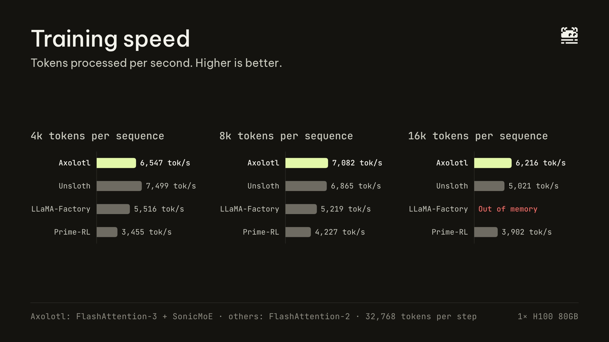

# GLM-4.7-Flash LoRA fine-tuning benchmark

Training throughput and GPU memory for LoRA fine-tuning of [zai-org/GLM-4.7-Flash](https://huggingface.co/zai-org/GLM-4.7-Flash) on a single H100 80GB, comparing Axolotl, Unsloth, LLaMA-Factory and Prime-RL under identical conditions.



## Results

### Throughput and peak memory (32,768 tokens per optimizer step)

| Framework | 4k-token sequences | 8k-token sequences | 16k-token sequences |
|---|---|---|---|
| Axolotl (FA3 + SonicMoE) | 6,547 tok/s · 58.8 GiB | 7,082 tok/s · 60.3 GiB | 6,216 tok/s · 62.9 GiB |
| Axolotl (defaults, FA2) | 5,596 tok/s · 57.9 GiB | 5,285 tok/s · 59.5 GiB | 4,197 tok/s · 62.8 GiB |
| Unsloth | 7,499 tok/s · 58.1 GiB | 6,864 tok/s · 59.3 GiB | 5,021 tok/s · 61.4 GiB |
| LLaMA-Factory | 5,516 tok/s · 66.3 GiB | 5,219 tok/s · 76.3 GiB | out of memory |
| Prime-RL | 3,455 tok/s · 64.0 GiB | 4,228 tok/s · 70.7 GiB | 3,902 tok/s · 74.7 GiB |

Tokens/sec = 32,768 ÷ mean wall-clock step time over steps 6–40. Memory = peak `torch.cuda.max_memory_reserved`.

### Long sequences (one sequence per optimizer step, 6 steps)

| Framework | 32k tokens | 64k tokens |
|---|---|---|
| Axolotl (FA3 + SonicMoE) | 7.19 s/step · 68.4 GiB | 22.36 s/step · 72.6 GiB |
| Axolotl (defaults, FA2) | 11.67 s/step · 69.2 GiB | 40.14 s/step · 73.0 GiB |
| Unsloth | 10.48 s/step · 65.6 GiB | 37.77 s/step · 73.7 GiB |
| LLaMA-Factory | out of memory | out of memory |
| Prime-RL | 11.95 s/step · 77.8 GiB | out of memory |

64k runs use CPU activation offload: Axolotl via `activation_offloading: hidden_states`; Unsloth offloads activations at every length by default.

Repeat runs at 8k for Unsloth, LLaMA-Factory and Prime-RL landed within 0.5% of the first run (`*-8k-r2`).

## Setup

- **Hardware:** 1× NVIDIA H100 80GB HBM3, driver 570 (CUDA 12.8).
- **Model:** GLM-4.7-Flash (30B MoE, ~3B active), bf16 weights, no quantization.
- **LoRA:** r=16, alpha=32, dropout 0, on the MLA attention projections `q_a_proj, q_b_proj, kv_a_proj_with_mqa, kv_b_proj, o_proj` = **21,031,936 trainable params** (verified in every run).
- **Data:** Axolotl's `_synthetic` generator (token ids 100–32,000, seed 42). Every row is exactly the sequence length: no packing, no padding. The same rows were exported (`scripts/gen_data.py`) and fed to every framework.
- **Batching:** micro-batch 1, gradient accumulation = 32,768 ÷ sequence length, so every optimizer step sees 32,768 tokens (verified by counting embedding inputs).
- **Training:** AdamW (fused), lr 1e-4 constant, gradient checkpointing on, 40 steps.

## Framework configuration

| Framework | Version | Settings |
|---|---|---|
| Axolotl (FA3 + SonicMoE) | main @ ba940e9 | Defaults + Cut Cross Entropy + `KernelsPlugin` with `use_sonicmoe: true` + `attn_implementation: kernels-community/flash-attn3` |
| Axolotl (defaults) | main @ ba940e9 | Defaults + Cut Cross Entropy, FlashAttention-2 |
| Unsloth | 2026.9.12 (transformers 5.5.0) | `FastLanguageModel` defaults, FlashAttention-2, Unsloth gradient checkpointing |
| LLaMA-Factory | 0.9.6.dev0 @ ce9dc9e0 (transformers 5.8.0) | Defaults, `flash_attn: fa2`, pre-tokenized data via `tokenized_path` |
| Prime-RL | main @ 1b929ec18 | FA2, `optimization_dtype: bfloat16`, no activation/optimizer offload, `torch.compile` off at 4k/8k and on at 16k |

Axolotl, Unsloth and LLaMA-Factory ran on torch 2.10.0+cu128 with the same FlashAttention 2.8.3 build. Prime-RL requires torch 2.13 + CUDA 13 and ran through `cuda-compat-13-0`.

**Prime-RL tuning.** Each setting was chosen for Prime-RL's best measured result on this model:
- Its FA3 path and MoE kernels require a Prime-RL custom model implementation; GLM-4.7-Flash falls back to the HF implementation, so FA2 is the available attention.
- The default fp32 `optimization_dtype` needs ~120 GB and cannot fit.
- Default activation and optimizer offload were measured slower (8.82 vs 8.40 s/step at 16k, `primerl-offload-16k`).
- `torch.compile` off was faster at 4k and 8k, on at 16k; both results are in `results/`.
- `reshard_after_forward: false` and selective activation checkpointing ran out of memory.

Prime-RL's SFT trainer only takes chat data or generated "fake" tokens, so `patches/prime-rl-replay-shared-data.patch` makes its fake dataset replay the shared rows instead.

**Note on attention.** The "FA3 + SonicMoE" Axolotl row uses FlashAttention-3; all other rows use FlashAttention-2.

## Measurement

`scripts/probe/sitecustomize.py` is loaded into every framework via `PYTHONPATH`, so the same code measures all four:
- a global `torch.optim` step post-hook records wall-clock time between optimizer steps and peak reserved/allocated memory;
- a hook on the vocabulary embedding counts tokens actually fed per step;
- an NVML thread samples `nvidia-smi` memory every 200 ms;
- trainable parameters are counted from the optimizer's parameter groups.

## Files

```
results/results.csv          one row per run (summary)
results/runs/<run>.json      per-run summary
results/per_step/<run>.jsonl per-optimizer-step time, tokens and memory
configs/                     exact config used for each run
scripts/                     data generator, config renderer, runner, probe, Unsloth script
patches/                     Prime-RL shared-data patch
charts/                      images (social cards and report charts, light and dark)
```

Configs contain absolute paths from the benchmark machine (`/workspace/data/bench/...`); adjust them to rerun.

## Reproduce

```bash
python scripts/gen_data.py 4096 8192 16384 32768 65536       # shared token rows
scripts/run.sh axolotl 8192 axolotl-8k                        # one run; see make_configs.py for per-framework settings
```
